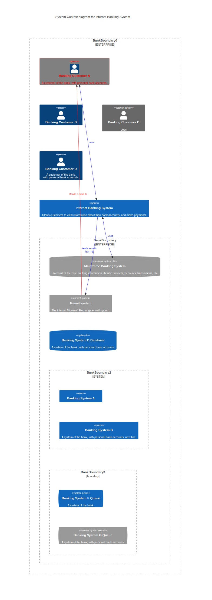

# Diagrams (Mermaid)

See: [README](../../README.md)

## PNG

### UML Class Diagram

### UML Sequence Diagram

### UML State Diagram

### C4 - Level 1 - Context Diagram

### C4 - Level 2 - Container Diagram

### C4 - Level 3 - Component Diagram

### C4 - Deployment Diagram

### Flowchart

### Entity/Relationship Diagram

### Mindmap

## SVG

### UML Class Diagram

### UML Sequence Diagram

### UML State Diagram

### C4 - Level 1 - Context Diagram

### C4 - Level 2 - Container Diagram

### C4 - Level 3 - Component Diagram

### C4 - Deployment Diagram

### Flowchart

### Entity/Relationship Diagram

### Mindmap

