# Diagrams (PlantUML)

See: [README](../../README.md)

## PNG

See: [Index](generated/png/index.md)

### UML Class Diagram

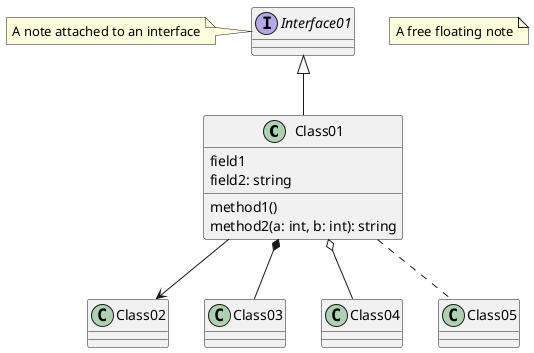

### UML Component Diagram

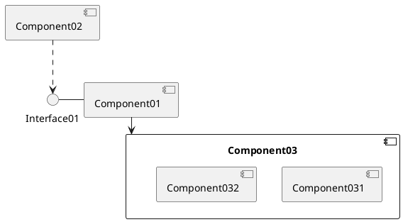

### UML Object Diagram

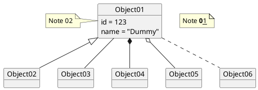

### UML Sequence Diagram

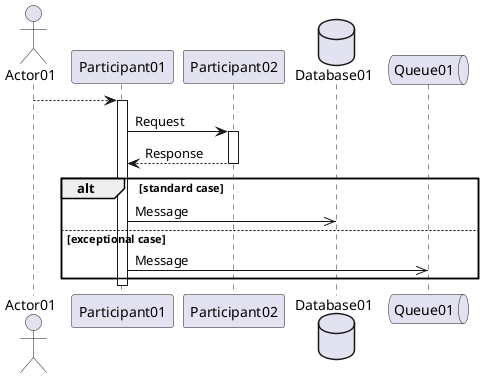

### UML State Diagram

### C4 - Level 1 - Context Diagram

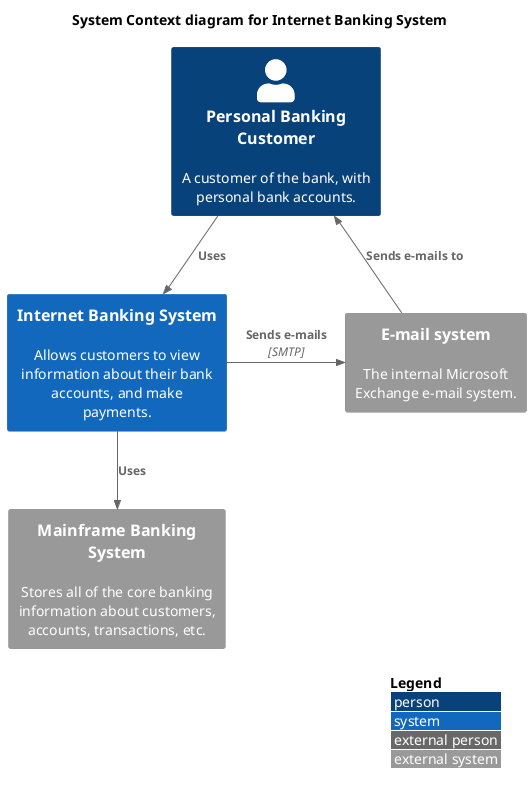

### C4 - Level 2 - Container Diagram

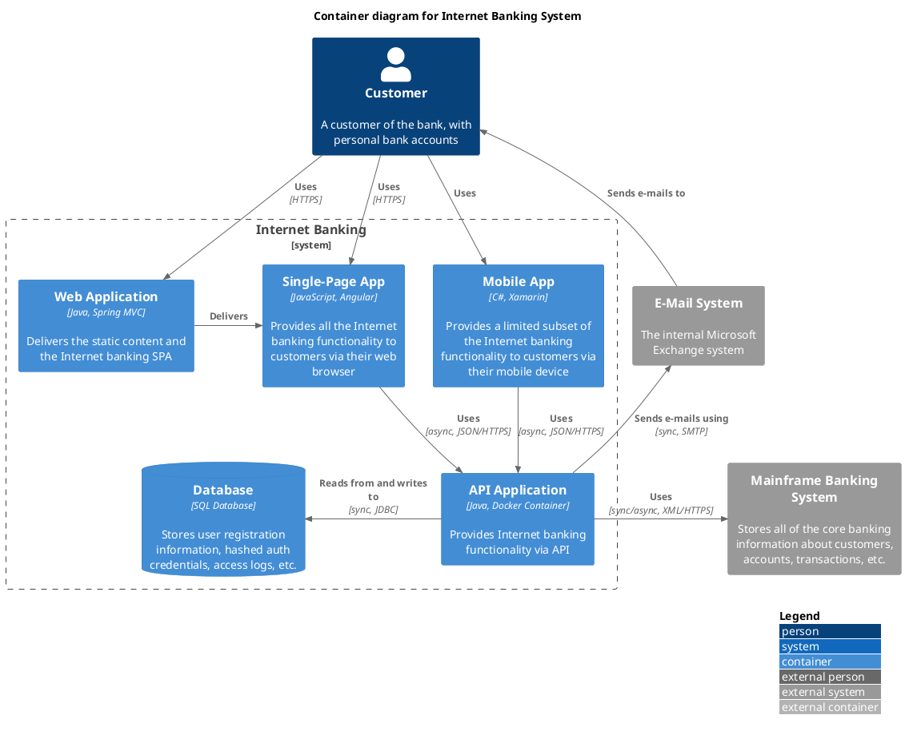

### C4 - Level 3 - Component Diagram

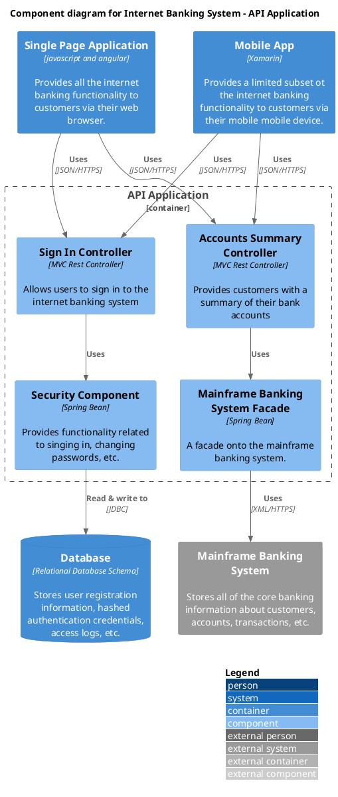

### C4 - System Landscape Diagram

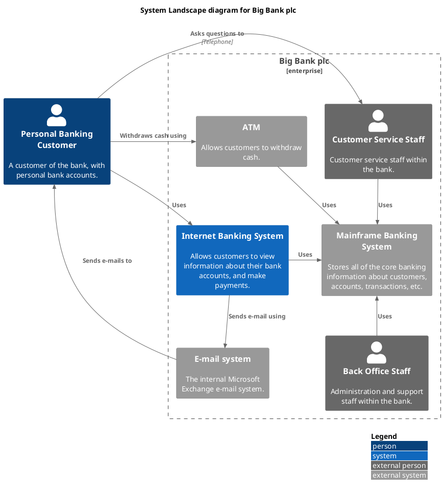

### C4 - Deployment Diagram

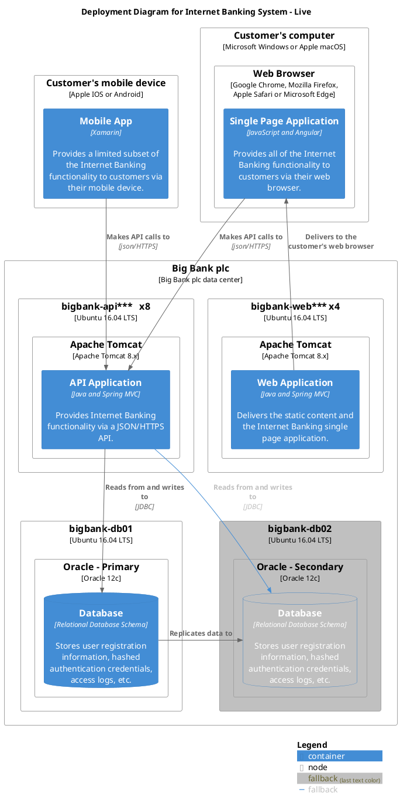

### Entity/Relationship Diagram

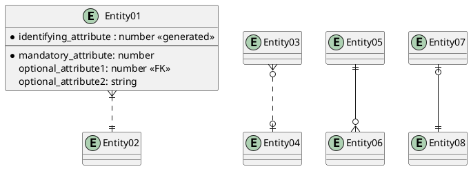

### Mindmap

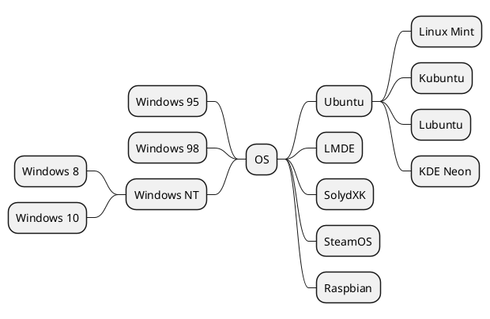

### JSON Diagram

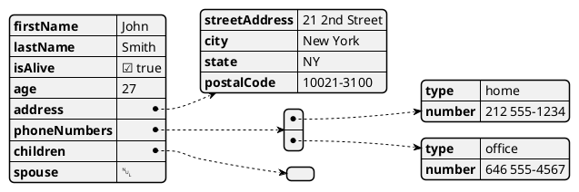

### Math (Ascii)

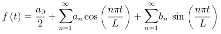

### Math (Latex)

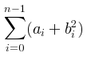

### Version

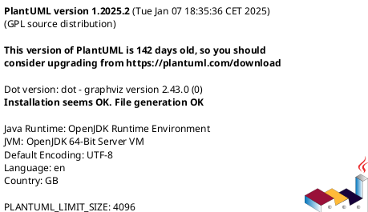

## SVG

See: [Index](generated/svg/index.md)

### UML Class Diagram

### UML Component Diagram

### UML Object Diagram

### UML Sequence Diagram

### UML State Diagram

### C4 - Level 1 - Context Diagram

### C4 - Level 2 - Container Diagram

### C4 - Level 3 - Component Diagram

### C4 - System Landscape Diagram

### C4 - Deployment Diagram

### Entity/Relationship Diagram

### Mindmap

### JSON Diagram

### Math (Ascii)

### Math (Latex)

### Version

