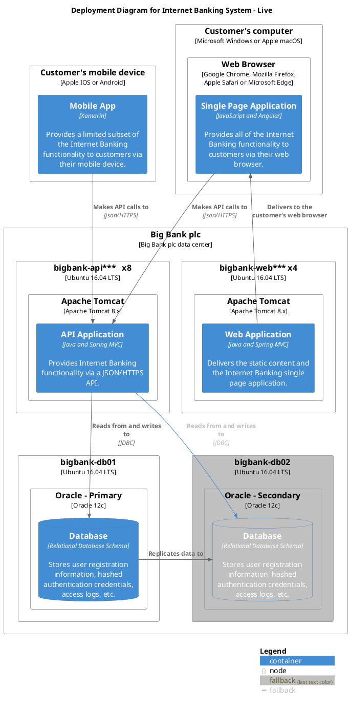
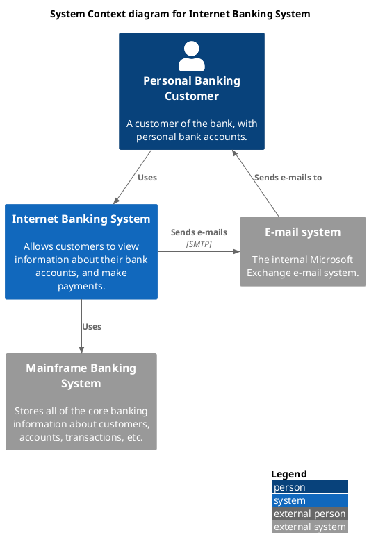
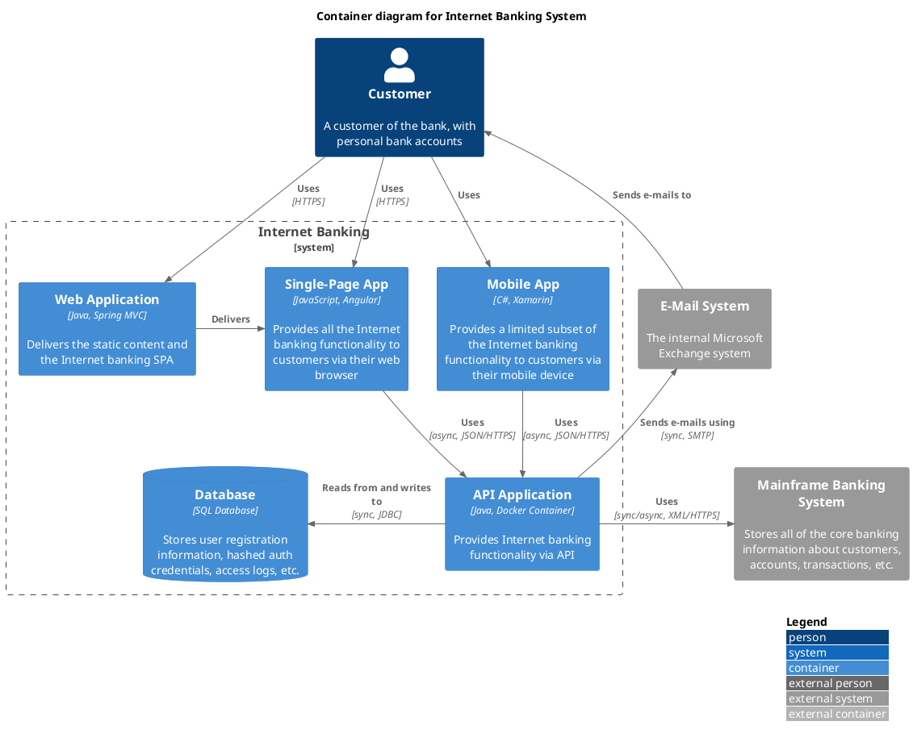
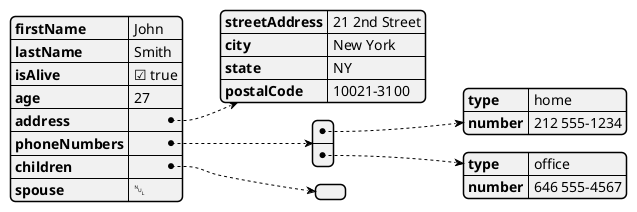
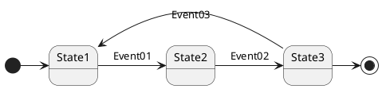
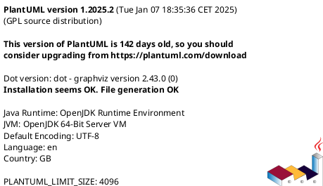

### c4-deployment-diagram

### c4-l1-context-diagram

### c4-l2-container-diagram

### c4-l3-component-diagram

### c4-system-landscape-diagram

### entity-relationship-diagram

### json-diagram

### math-ascii

### math-latex

### mindmap

### uml-class-diagram

### uml-component-diagram

### uml-object-diagram

### uml-sequence-diagram

### uml-state-diagram

### version

