### c4-deployment-diagram
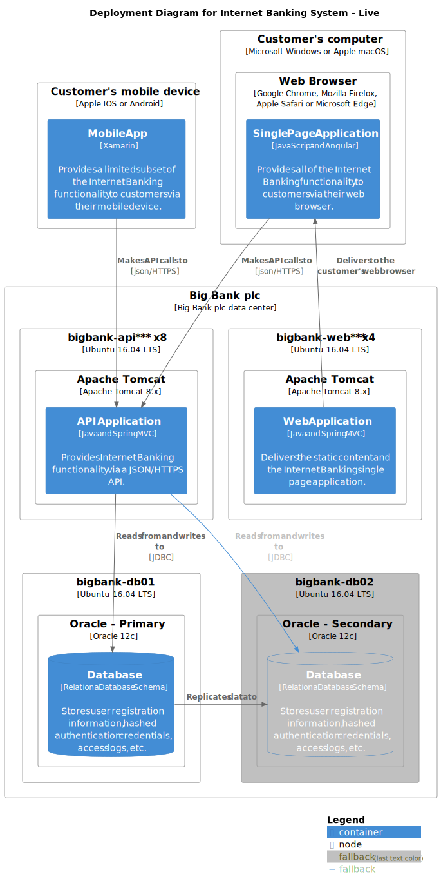

### c4-l1-context-diagram
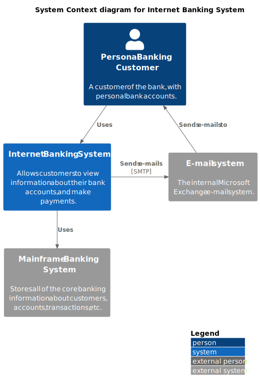

### c4-l2-container-diagram
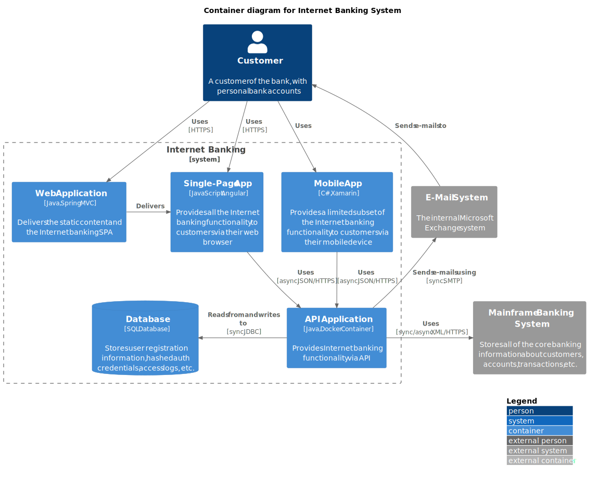

### c4-l3-component-diagram
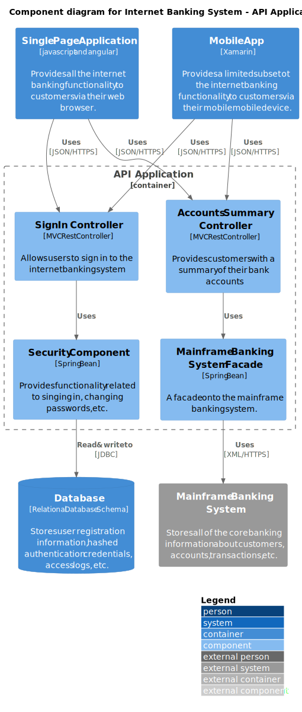

### c4-system-landscape-diagram
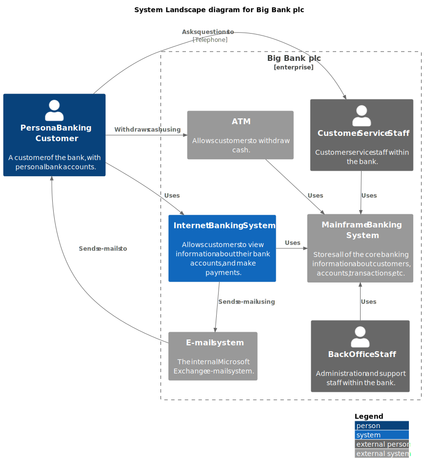

### entity-relationship-diagram
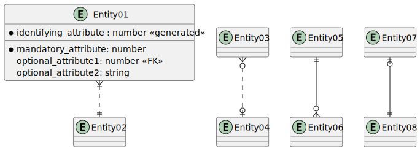

### json-diagram
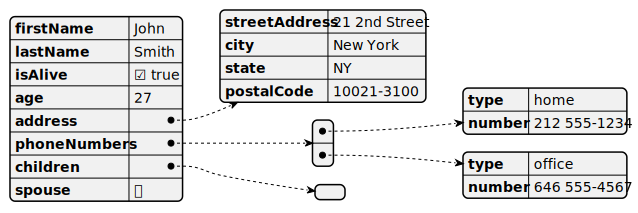

### math-ascii
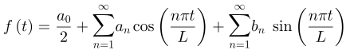

### math-latex
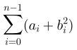

### mindmap
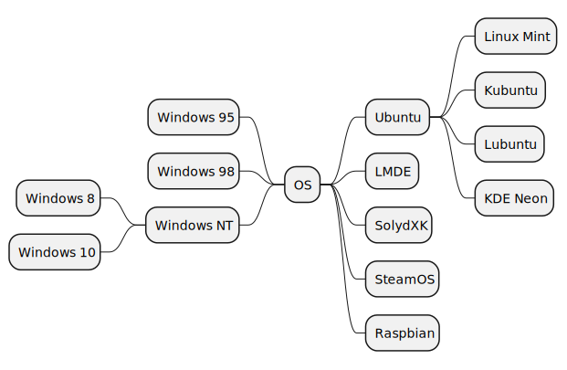

### uml-class-diagram
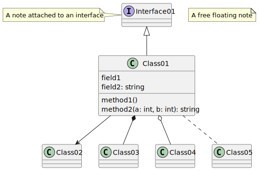

### uml-component-diagram
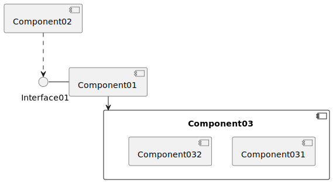

### uml-object-diagram
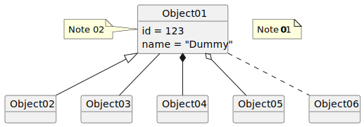

### uml-sequence-diagram

### uml-state-diagram
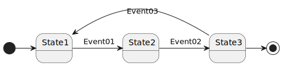

### version

